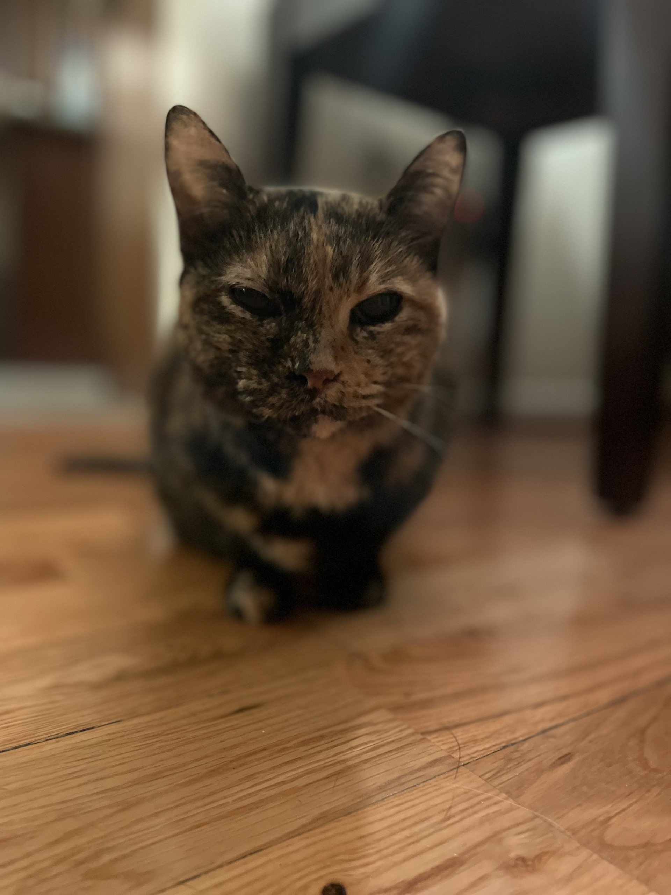

### Hi there 👋

<!--
**LaurenFPU/LaurenFPU** is a ✨ _special_ ✨ repository because its `README.md` (this file) appears on your GitHub profile.

Here are some ideas to get you started:

- 🔭 I’m currently working on ...
- 🌱 I’m currently learning ...
- 👯 I’m looking to collaborate on ...
- 🤔 I’m looking for help with ...
- 💬 Ask me about ...
- 📫 How to reach me: ...
- 😄 Pronouns: ...
- ⚡ Fun fact: ...
-->

---

<table>
<tr>
<th align="center">

</th>
<th align="center">

</th>
</tr>
<tr>
<td>

Hi, I'm Lauren

&nbsp;  

I'm an [analytical chemist](https://www.acs.org/careers/chemical-sciences/areas/analytical-chemistry.html), with a background in 

- [Data Science](https://en.wikipedia.org/wiki/Data_science) (M.S.)
- [Physics](https://www.iop.org/explore-physics) (B.S.)
- [Geology](https://www.nps.gov/subjects/geology/geology-concepts.htm) (minor)

&nbsp;  

I mostly code for fun and curiosity and am interested in the use of data science in the physical sciences. 

---

 &nbsp; 

---
  
</td>
<td>

{width=500px}
  
</td>
</tr>
</tr>
</table>
